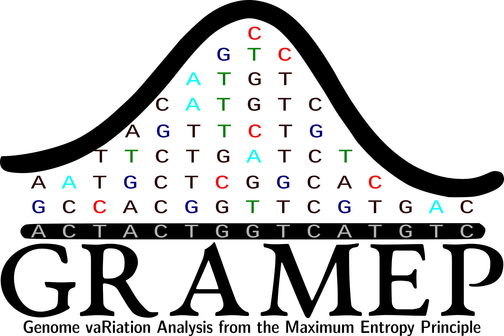

# GRAMEP - Genome vaRiation Analysis from the Maximum Entropy Principle

[](https://gramep.readthedocs.io/en/latest/?badge=latest)


**GRAMEP** is a powerful, Python-based tool designed for the precise identification of Single Nucleotide Polymorphisms (SNPs) within biological sequences.  It goes beyond basic SNP identification, offering advanced functionalities including:

* **Intersection analysis:** Analyze mutations found in different variants to identify shared mutations.
* **Phylogeny generation:** Generate a phylogenetic tree based on the exclusive mutations found for each variant.
* **Classification model training:** Train a classification model to predict the class of new sequences.

GRAMEP is accessible through a robust and intuitive Command-Line Interface (CLI). The primary command is `gramep`, with sub-commands for each action the application can perform.


For detailed information, access the documentation.

## How to install

The use of `pipx` is recommended for installing GRAMEP:


```bash
pipx install gramep
```

Although this is only a recommendation, you can also install the project with the manager of your choice. For example, `pip`:


```bash
pip install gramep
```

## Quick Guide

### Identifying the most informative SNPs

To identify the most informative Single Nucleotide Polymorphisms (SNPs) using GRAMEP, you will utilize the `get-mutations` command. Below, you will find the basic usage of this command:

```bash
gramep get-mutations [OPTIONS]
```

For detailed information on available options and how to use them, simply enter the following command:

```bash
gramep get-mutations --help
```

This will provide you with comprehensive guidance on how to make the most of the `get-mutations` command, allowing you to efficiently analyze and extract valuable SNPs from your biological sequences.

### Identifying Mutation Intersection Between Variants

To identify the intersection of mutations present in two or more variants of the same organism, you can utilize the `get-intersection`` command provided by GRAMEP. Below, we outline the basic usage of this command:

```bash
gramep get-intersection [OPTIONS]
```

This command allows you to analyze and find common mutations shared among multiple variant sequences. For detailed information on available options and how to make the most of the `get-intersection` command, simply use the `--help` flag:

```bash
gramep get-intersection --help
```

### Getting a basic phylogeny

Generate a basic phylogeny based on the unique mutations identified for each variant using GRAMEP's `phylogenetic` command. Here's a basic example:

```bash
gramep phylogenetic [OPTIONS]
```

For detailed information on each available option and its usage, utilize the `--help` flag. This flag provides comprehensive details about this functionality.

### Classifying Biological Sequences

To classify biological sequences using GRAMEP, you can utilize the `classify` command. Here is the basic usage of this command:

```bash
gramep classify [OPTIONS]
```

This command allows you to perform sequence classification tasks with ease. For detailed information on available options and how to use them effectively, use the `--help` flag:

```bash
gramep classify --help
```

### Predicting Biological Sequences

The `predict` command of GRAMEP is used to perform class predictions on new biological sequences after training a classification model. Below, you'll find the basic usage of this command:

```bash
gramep predict [OPTIONS]
```

This command allows you to leverage your trained classification model to predict the classes of new biological sequences. For detailed information on available options and how to use them effectively, utilize the `--help` flag:

```bash
gramep predict --help
```

## Citation
Soon

##### Acknowledgements

* This study was financed in part by the Coordenação de Aperfeiçoamento de Pessoal de Nível Superior - Brasil (CAPES) - Finance Code 001, the Fundação Araucária, Governo do Estado do Paraná/SETI (Grant number 035/2019, 138/2021 and NAPI - Bioinformática).
